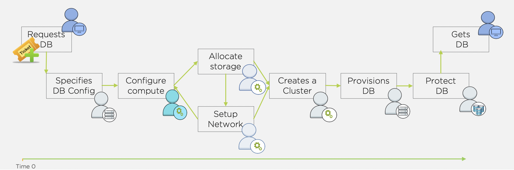

.. _deploy_oracle:

-----------------
Deploying Oracle
-----------------

Traditional database VM deployment resembles the diagram below. The process generally starts with a IT ticket for a database (from Dev, Test, QA, Analytics, etc.). Next one or more teams will need to deploy the storage resources and VM(s) required. Once infrastructure is ready, a DBA needs to provision and configure database software. Once provisioned, any best practices and data protection/backup policies need to be applied. Finally the database can be handed over to the end user. That's a lot of handoffs, and the potential for a lot of friction.

Whereas with a Nutanix cluster and Era, provisioning and protecting a database should take you no longer than it took to read this intro.

Source Oracle VM
++++++++++++++++++++++

**In this lab you will deploy a Oracle VM, by cloning a source Oracle 19c Source VM. This VM will act as a master image to create a profile for deploying additional Oracle VMs using Era.**

This VM is running Oracle 19c with April PSU patches applied.

#. In **Prism Central**, select :fa:`bars` **> Virtual Infrastructure > VMs**.

   .. figure:: images/1.png

#. Select the checkbox for *USerXX*\ **-Oracle19cSource**, and click **Actions > Clone**.

   .. figure:: images/1b.png

#. Fill out the following fields:

   - **Number Of Clones** - 1
   - **Name** - *UserXX*\ **-MSSQLSourceVM-Patched**
   - **Description** - (Optional) Description for your VM.
   - **vCPU(s)** - 2
   - **Number of Cores per vCPU** - 1
   - **Memory** - 8 GiB

#. Click **Save** to create the VM.

#. Select VM and click **Actions > Power On**.

Exploring Era Resources
+++++++++++++++++++++++

Era is distributed as a virtual appliance that can be installed on either AHV or ESXi. For the purposes of conserving memory resources, a shared Era server has already been deployed on your cluster.

.. note::

   If you're interested, instructions for the brief installation of the Era appliance can be found `here <https://portal.nutanix.com/#/page/docs/details?targetId=Nutanix-Era-User-Guide-v12:era-era-installing-on-ahv-t.html>`_.

#. In **Prism Central > VMs > List**, identify the IP address assigned to the **EraServer-\*** VM using the **IP Addresses** column.

#. Open \https://*ERA-VM-IP:8443*/ in a new browser tab.

#. Login using the following credentials:

   - **Username** - admin
   - **Password** - *<Cluster Password>*

#. From the **Dashboard** dropdown, select **Administration**.

#. Under **Cluster Details**, note that Era has already been configured for your assigned cluster.

   .. figure:: images/6.png

#. Select **Era Resources** from the left-hand menu.

#. Review the configured Networks. If no Networks show under **VLANs Available for Network Profiles**, click **Add**. Select **Secondary** VLAN and click **Add**.

   .. note::

      Leave **Manage IP Address Pool** unchecked, as we will be leveraging the cluster's IPAM to manage addresses

   .. figure:: images/era_networks_001.png

#. From the dropdown menu, select **SLAs**.

   .. figure:: images/7a.png

   Era has five built-in SLAs (Gold, Silver, Bronze, Zero, and Brass). SLAs control how the database server is backed up. This can be with a combination of Continuous Protection, Daily, Weekly Monthly and Quarterly protection intervals.

#. From the dropdown menu, select **Profiles**.

   Profiles pre-define resources and configurations, making it simple to consistently provision environments and reduce configuration sprawl. For example, Compute Profiles specifiy the size of the database server, including details such as vCPUs, cores per vCPU, and memory.

#. If you do not see any networks defined under **Network**, click **+ Create**.

   .. figure:: images/8.png

#. Fill out the following fields and click **Create**:

   - **Engine** - ORACLE
   - **Type** - Single Instance
   - **Name** - Primary_ORACLE_NETWORK
   - **Public Service VLAN** - Secondary

   .. figure:: images/9.png

Register Oracle Server with Era
+++++++++++++++++++++++++++++++

In this exercise, you will register your April PSU VM and register it as version 1.0 of your Oracle 19c Software Profile. The Software Profile is a template containing both the operating system and database software, and can be used to deploy additional database servers.

#. In **Era**, select **Database Servers** from the dropdown menu and **List** from the lefthand menu.

#. Click **+ Register** and fill out the following **Database Server** fields:

   - **Engine** - Oracle
   - **IP Address or Name of VM** - *UserXX*\ **-MSSQLSourceVM**
   - **Database Version** - 19.0.0.0
   - **Era Drive User** - oracle
   - **Oracle Database Home** - /u02/app/oracle/product/19.0.0/dbhome_1
   - **Grid Infrastructure Home** - /u01/app/19.0.0/grid
   - **Provide Credentials Through** - Password
   - **Password** - Nutanix/4u

   .. note::

      The Era Drive User can be any user on the VM that has sudo access with NOPASSWD setting. Era will use this user's credentials to perform various operations, such as taking snapshots.

      Oracle Database Home is the directory where the Oracle database software is installed, and is a mandatory parameter for registering a database server.

      Grid Infrastructure Home is the directory where the Oracle Grid Infrastructure software is installed. This is only applicable for Oracle RAC or SIHA databases.

   .. figure:: images/2.png

#. Click **Register**

#. Select **Operations** from the dropdown menu to monitor the registration. This process should take approximately 5 minutes. Wait for the registration operation to successfully complete before moving on.

   Once the *Initials*\ **_oracle_base** server has been registered with Era, we need to create a software profile in order to deploy additional Oracle VMs.

#. Select **Profiles** from the dropdown menu and **Software** from the lefthand menu.

#. Click **+ Create** and fill out the following fields:

   - **Engine** - Oracle
   - **Type** - Single Instance
   - **Name** - *Initials*\ _ORACLE_19C
   - **Description** - (Optional)
   - **Database Server** - Select your registered *UserXX*\ **-MSSQLSourceVM**

   .. figure:: images/3.png

#. Click **Create**.

#. Select **Operations** from the dropdown menu to monitor the registration. This process should take approximately 5 minutes.

Register Your Database
++++++++++++++++++++++

#. In **Era**, select **Databases** from the dropdown menu and **Sources** from the lefthand menu.

   .. figure:: images/11.png

#. Click **+ Register** and fill out the following fields:

   - **Engine** - ORACLE
   - **Database is on a Server that is:** - Registered
   - **Registered Database Servers** - Select your registered *UserXX*\ **-MSSQLSourceVM**

   .. figure:: images/12.png

#. Click **Next**

   - **Database Name in Era** - *Initials*\ -orcl
   - **SID** - orcl19c

   .. note::

     The Oracle System ID (SID) is used to uniquely identify a particular database on a system. For this reason, one cannot have more than one database with the same SID on a computer system. When using RAC, all instances belonging to the same database must have unique SID's.

   .. figure:: images/13.png

#. Click **Next**

   - **Name** - *Initials*\ -orcl_TM
   - **SLA** - DEFAULT_OOB_BRASS_SLA (no continuous replay)

   .. figure:: images/14.png

#. Click **Register**

#. Select **Operations** from the dropdown menu to monitor the registration. This process should take approximately 5 minutes.
